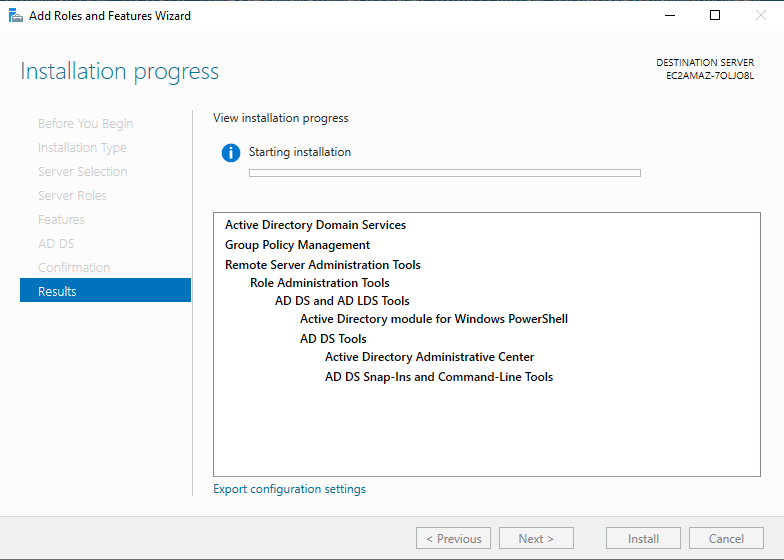
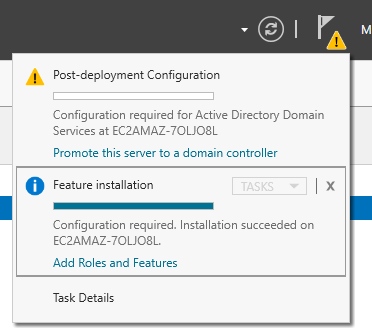

# 🧪 Laboratorio 3: Incorporación de estación de trabajo al dominio
## 🔧 Requisitos:
-Tener una instancia de Windows Server con AD DS configurado (DC).
-Una instancia de Windows 10 o Windows 11 como cliente.
-Ambas instancias en la misma VPC y subred.
## 👣 Pasos:
### 1. Promover el Windows Server como DC
#### 1.1 Agregar el rol de Active Directory Domain Services (AD DS)
Desde Server Manager:
- Haz clic en "Manage" (esquina superior derecha).
- Selecciona "Add Roles and Features".
En el asistente:
- Tipo de instalación: Role-based
- Selecciona tu servidor (EC2AMAZ-70LJ08L)
- En la lista de roles, marca: ✅ Active Directory Domain Services
- Acepta las características adicionales que te pida instalar.
- Completa la instalación y no cierres Server Manager.

En el Server:
- Después de instalar AD DS 
- Haz clic en la bandera amarilla.
- Abrir notificación "Promote this server to a domain controller".
Elegir:
- Agregar nuevo bosque
- Dominio raíz: midominio.local
- Establecer contraseña de recuperación DSRM.
- Completar instalación y reiniciar.
### 2. Configurar IP fija en ambas máquinas
Asegúrate de:
- Windows Server tenga IP fija y sea servidor DNS.
- Cliente apunte al DNS del servidor (Windows Server).
### 3. Unir cliente al dominio
En Windows 10/11:
- Panel de control > Sistema > Configuración del sistema.
- Cambiar nombre y dominio del equipo.
- En Dominio: escribe midominio.local
- Usuario: Administrador del dominio (ej. Administrator del DC)
- Reiniciar.
### 4. Probar inicio de sesión con usuario del dominio
- En el cliente, cerrar sesión.
- Iniciar sesión como MIDOMINIO\usuario.